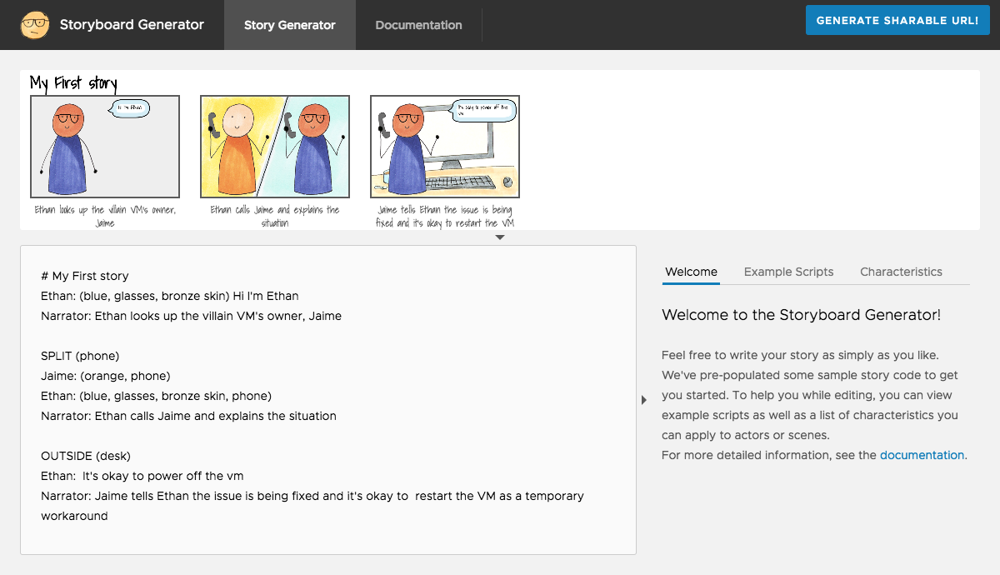

# Storyboard Generator

Developed as part of a Borathon project, Storyboard Generator is a tool to help R&D Product teams develop and create their own storyboards to help with the product design process.



## Try it out

```
$ docker build -t storyboardgenerator-repo .
$ docker run -p 80:80 -t storyboardgenerator-repo
```
Storyboard Generator is running on http://localhost

## Contributing

The storyboard generator project team welcomes contributions from the community. If you wish to contribute code and you have not
signed our contributor license agreement (CLA), our bot will update the issue when you open a Pull Request. For any
questions about the CLA process, please refer to our [FAQ](https://cla.vmware.com/faq). For more detailed information,
refer to [CONTRIBUTING.md](CONTRIBUTING.md).

## License

Copyright 2018 VMware, Inc.  All rights reserved

The BSD-2 license (the “License”) set forth below applies to all parts of the Storyboard Generator
project.  You may not use this file except in compliance with the License. 

BSD-2 License

Redistribution and use in source and binary forms, with or without modification, are permitted provided that the following conditions are met:
•	Redistributions of source code must retain the above copyright notice, this list of conditions and the following disclaimer.
•	Redistributions in binary form must reproduce the above copyright notice, this list of conditions and the following disclaimer in the documentation and/or other materials provided with the distribution.
THIS SOFTWARE IS PROVIDED BY THE COPYRIGHT HOLDERS AND CONTRIBUTORS "AS IS" AND ANY EXPRESS OR IMPLIED WARRANTIES, INCLUDING, BUT NOT LIMITED TO, THE IMPLIED WARRANTIES OF MERCHANTABILITY AND FITNESS FOR A PARTICULAR PURPOSE ARE DISCLAIMED. IN NO EVENT SHALL THE COPYRIGHT HOLDER OR CONTRIBUTORS BE LIABLE FOR ANY DIRECT, INDIRECT, INCIDENTAL, SPECIAL, EXEMPLARY, OR CONSEQUENTIAL DAMAGES (INCLUDING, BUT NOT LIMITED TO, PROCUREMENT OF SUBSTITUTE GOODS OR SERVICES; LOSS OF USE, DATA, OR PROFITS; OR BUSINESS INTERRUPTION) HOWEVER CAUSED AND ON ANY THEORY OF LIABILITY, WHETHER IN CONTRACT, STRICT LIABILITY, OR TORT (INCLUDING NEGLIGENCE OR OTHERWISE) ARISING IN ANY WAY OUT OF THE USE OF THIS SOFTWARE, EVEN IF ADVISED OF THE POSSIBILITY OF SUCH DAMAGE.
